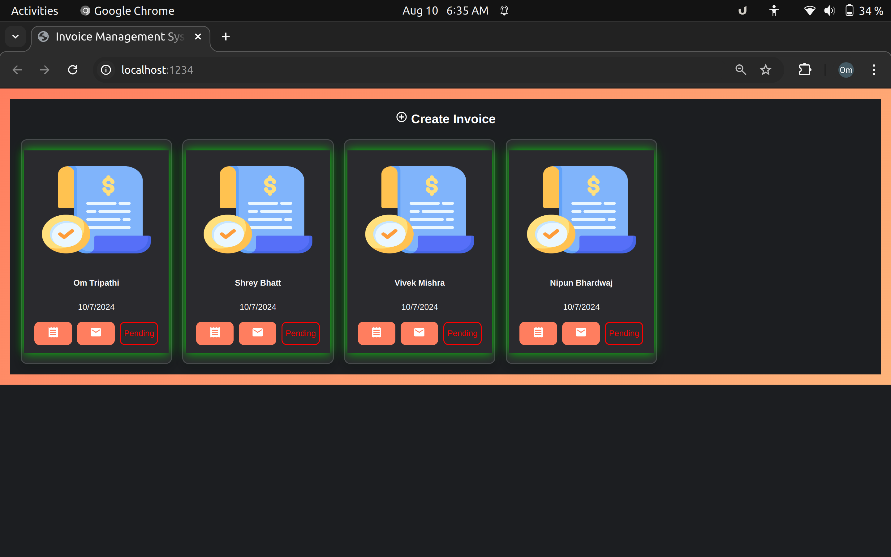
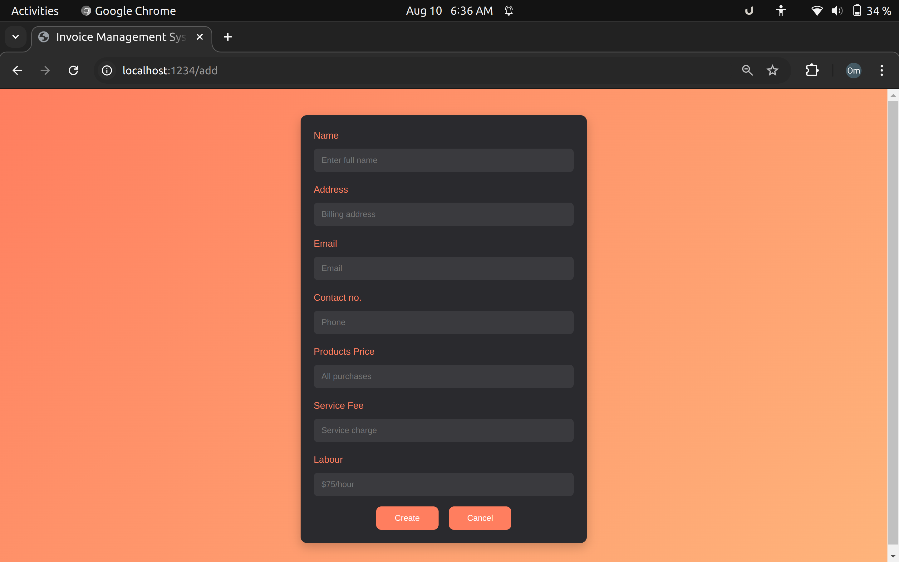
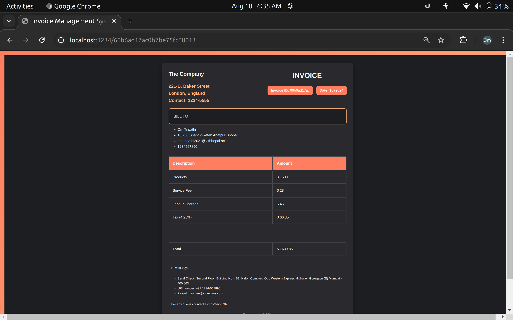

# Invoice Generator App

---

## Technologies and Tools Used

1. ReactJS
2. NodeJS (with Express)
3. MongoDB
4. CSS and Material-UI for design.

---

## Steps to Run

1. Download ZIP file to your local system and extract it.
2. Navigate to the main folder and run `npm install` to install all dependencies.
3. Navigate to the client folder and run `npm install` again.
4. Return to the main folder and run `npm run dev` to run the development server.
5. Open localhost:3000 if that does not happen automatically.

---

## Features

1. **Dashboard**: View summarized information of all invoices on the home page. Each summary includes the name, creation date, status, and color-coded indication of overdue status.

2. **Invoice Details**: Access detailed information about each invoice by clicking on the view button.

3. **Email Notification**: Send email notifications to recipients with the total amount of the invoice.

4. **Invoice Creation**: Create new invoices using a user-friendly form interface.

---

## Demo Images

**Home Page**

**Invoice Creation Form**

**Nodemailer Mail Sending**

**Invoice Details**

---
